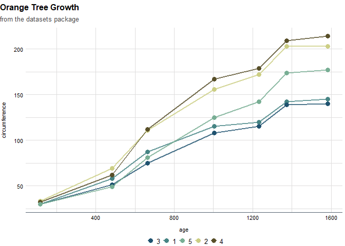

<!-- README.md is generated from README.Rmd. Please edit that file -->

# possibilitylabthemes

<!-- badges: start -->
<!-- badges: end -->

possibilitylabthemes provides a custom ggplot2 theme with Possibility
Lab color palettes and styles.

## Installation

You can install the development version of possibilitylabthemes from
[GitHub](https://github.com/) with:

``` r
# install.packages("devtools")
devtools::install_github("Possibility-Lab/possibilitylabthemes")
```

## Using the theme

You can set the Possibility Lab theme as the default for an R session.

``` r
library(tidyverse)
#> -- Attaching packages --------------------------------------- tidyverse 1.3.1 --
#> v ggplot2 3.4.2      v purrr   1.0.1 
#> v tibble  3.2.1      v dplyr   1.0.10
#> v tidyr   1.1.4      v stringr 1.5.0 
#> v readr   2.0.2      v forcats 0.5.1
#> Warning: package 'ggplot2' was built under R version 4.1.3
#> Warning: package 'tibble' was built under R version 4.1.3
#> Warning: package 'purrr' was built under R version 4.1.3
#> Warning: package 'dplyr' was built under R version 4.1.3
#> Warning: package 'stringr' was built under R version 4.1.3
#> -- Conflicts ------------------------------------------ tidyverse_conflicts() --
#> x dplyr::filter() masks stats::filter()
#> x dplyr::lag()    masks stats::lag()
library(possibilitylabthemes)
#> 
#> Attaching package: 'possibilitylabthemes'
#> The following objects are masked from 'package:ggplot2':
#> 
#>     scale_color_discrete, scale_color_gradientn, scale_color_ordinal,
#>     scale_colour_discrete, scale_colour_gradientn,
#>     scale_colour_ordinal, scale_fill_discrete, scale_fill_gradientn,
#>     scale_fill_ordinal

possibility_defaults()
```

You can specify certain visualization types for more a more tailored
theme.

``` r
possibility_defaults("map")
```

Set the Possibility Lab theme as the default, then plot with ggplot as
normal. To use color palettes other than the default, you can use
`scale_color_manual(values = possibility_palette("discrete"))`, for
example. Palettes available can be returned by `possibility_palettes`.

    #> Warning in grid.Call(C_stringMetric, as.graphicsAnnot(x$label)): font family not
    #> found in Windows font database

    #> Warning in grid.Call(C_stringMetric, as.graphicsAnnot(x$label)): font family not
    #> found in Windows font database

    #> Warning in grid.Call(C_stringMetric, as.graphicsAnnot(x$label)): font family not
    #> found in Windows font database
    #> Warning in grid.Call(C_textBounds, as.graphicsAnnot(x$label), x$x, x$y, : font
    #> family not found in Windows font database

    #> Warning in grid.Call(C_textBounds, as.graphicsAnnot(x$label), x$x, x$y, : font
    #> family not found in Windows font database

    #> Warning in grid.Call(C_textBounds, as.graphicsAnnot(x$label), x$x, x$y, : font
    #> family not found in Windows font database

    #> Warning in grid.Call(C_textBounds, as.graphicsAnnot(x$label), x$x, x$y, : font
    #> family not found in Windows font database

    #> Warning in grid.Call(C_textBounds, as.graphicsAnnot(x$label), x$x, x$y, : font
    #> family not found in Windows font database

    #> Warning in grid.Call(C_textBounds, as.graphicsAnnot(x$label), x$x, x$y, : font
    #> family not found in Windows font database

    #> Warning in grid.Call(C_textBounds, as.graphicsAnnot(x$label), x$x, x$y, : font
    #> family not found in Windows font database
    #> Warning in grid.Call.graphics(C_text, as.graphicsAnnot(x$label), x$x, x$y, :
    #> font family not found in Windows font database
    #> Warning in grid.Call(C_textBounds, as.graphicsAnnot(x$label), x$x, x$y, : font
    #> family not found in Windows font database

    #> Warning in grid.Call(C_textBounds, as.graphicsAnnot(x$label), x$x, x$y, : font
    #> family not found in Windows font database



## Font

Possibility Lab uses the Source Sans Pro font. Help with installing and
testing fonts will be added soon.

## Citations

Thanks for the
[urbnthemes](https://github.com/UrbanInstitute/urbnthemes) package for
inspiration and examples.
