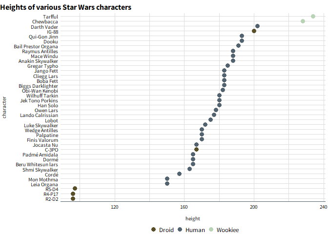

<!-- README.md is generated from README.Rmd. Please edit that file -->

# possibilitylabthemes

<!-- badges: start -->
<!-- badges: end -->

possibilitylabthemes provides a custom ggplot2 theme with Possibility
Lab color palettes and styles.

## Installation

possibilitylabthemes is still in development, but you can install the
development version of possibilitylabthemes from
[GitHub](https://github.com/) with:

``` r
# install.packages("devtools")
devtools::install_github("Possibility-Lab/possibilitylabthemes")
```

## Using the theme

You can set the Possibility Lab theme as the default for an R session.


To use color palettes other than the default, you can use
`scale_color_manual(values = possibility_palette("discrete"))`, for
example. Palettes available can be returned by `possibility_palettes`.

When you wish to add more major or minor gridlines, use
`possibility_add_grid()`.




## Maps

You can set the default theme to a “map” style.

``` r
possibility_defaults("map")

berk <- sf::st_read(
  "https://data.cityofberkeley.info/api/geospatial/6is2-y2ia?method=export&format=GeoJSON")
#> Reading layer `OGRGeoJSON' from data source 
#>   `https://data.cityofberkeley.info/api/geospatial/6is2-y2ia?method=export&format=GeoJSON' 
#>   using driver `GeoJSON'
#> Simple feature collection with 1 feature and 2 fields
#> Geometry type: MULTIPOLYGON
#> Dimension:     XY
#> Bounding box:  xmin: -122.3249 ymin: 37.84589 xmax: -122.2342 ymax: 37.90584
#> Geodetic CRS:  WGS 84

blvds <- sf::st_read(
  "https://data.cityofberkeley.info/api/geospatial/fgw9-98ic?method=export&format=GeoJSON") %>% 
  mutate(type = "Bicycle Boulevard") %>% 
  select(type, geometry)
#> Reading layer `OGRGeoJSON' from data source 
#>   `https://data.cityofberkeley.info/api/geospatial/fgw9-98ic?method=export&format=GeoJSON' 
#>   using driver `GeoJSON'
#> Simple feature collection with 211 features and 6 fields
#> Geometry type: MULTILINESTRING
#> Dimension:     XY
#> Bounding box:  xmin: -122.3002 ymin: 37.84627 xmax: -122.2446 ymax: 37.88661
#> Geodetic CRS:  WGS 84

trails <- sf::st_read(
  "https://data.cityofberkeley.info/api/geospatial/yepa-z7vf?accessType=DOWNLOAD&method=export&format=GeoJSON"
  ) %>% 
  mutate(type = "Path") %>% 
  select(type, geometry)
#> Reading layer `OGRGeoJSON' from data source 
#>   `https://data.cityofberkeley.info/api/geospatial/yepa-z7vf?accessType=DOWNLOAD&method=export&format=GeoJSON' 
#>   using driver `GeoJSON'
#> Simple feature collection with 164 features and 3 fields
#> Geometry type: MULTILINESTRING
#> Dimension:     XY
#> Bounding box:  xmin: -122.3246 ymin: 37.85119 xmax: -122.2375 ymax: 37.90373
#> Geodetic CRS:  WGS 84

streets <- sf::st_read(
  "https://data.cityofberkeley.info/api/geospatial/hqnk-qfhq?method=export&format=GeoJSON")
#> Reading layer `OGRGeoJSON' from data source 
#>   `https://data.cityofberkeley.info/api/geospatial/hqnk-qfhq?method=export&format=GeoJSON' 
#>   using driver `GeoJSON'
#> Simple feature collection with 6969 features and 10 fields
#> Geometry type: MULTILINESTRING
#> Dimension:     XY
#> Bounding box:  xmin: -122.3246 ymin: 37.8361 xmax: -122.2086 ymax: 37.94531
#> Geodetic CRS:  WGS 84

paths <- streets %>% filter(street_typ %in% c("PATH", "TRAIL")) %>% 
  mutate(type = "Path") %>% 
  select(type, geometry)

routes <- rbind(blvds, trails, paths)


ggplot(data = sf::st_intersection(
         filter(streets, !(street_typ %in% c("PATH", "TRAIL"))),
         berk)
       ) +
  geom_sf(color = "#d6d6d6") +
  geom_sf(data = routes, aes(color = type)) +
  labs(title = "Getting around Berkeley on named paths and bicycle boulevards")
```


## Saving plots

Use `possibility_save()` to save plots as png files. Preset sizes -
“small”, “medium”, or “large” - will save your plot at predetermined
dimensions and scale all fonts and graphic elements accordingly. Choose
an orientation - “horizontal” or “vertical” - depending on your chart
type. `possibility_save()` uses `ragg::agg_png` to save as a png file,
which is the most suitable file format for including graphics in word
documents and presentations.

## Font: Source Sans Pro

Possibility Lab uses the Source Sans Pro font. Help with installing and
testing fonts will be added soon.

## Citations

Thanks and credit to the
[urbnthemes](https://github.com/UrbanInstitute/urbnthemes) package for
inspiration and examples.
