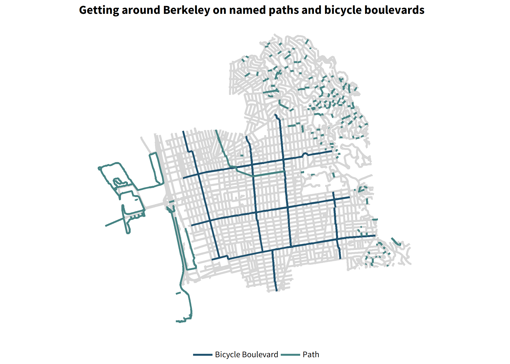

<!-- README.md is generated from README.Rmd. Please edit that file -->

# possibilitylabthemes

<!-- badges: start -->
<!-- badges: end -->

possibilitylabthemes provides a custom ggplot2 theme with Possibility
Lab color palettes and styles.

## Installation

possibilitylabthemes is still in development, but you can install the
development version of possibilitylabthemes from
[GitHub](https://github.com/) with:

``` r
# install.packages("devtools")
devtools::install_github("Possibility-Lab/possibilitylabthemes")
```

## Using the theme

You can set the Possibility Lab theme as the default for an R session.

``` r
library(tidyverse)
library(extrafont)
extrafont::loadfonts(device = "win")

library(possibilitylabthemes)
possibility_defaults()
```

``` r
ggplot(df) +
  geom_line(aes(time, price, color = index)) +
  labs(title = "Daily Closing Prices of Major European Stock Indices, 1991-1998")
```


To use color palettes other than the default, you can use
`scale_color_manual(values = possibility_palette("discrete"))`, for
example. Palettes available can be returned by `possibility_palettes`.

When you wish to add more major or minor gridlines, use
`possibility_add_grid()`.

``` r
ggplot(filter(starwars, species %in% c("Human", "Droid", "Wookiee") &
                !is.na(height))) +
  geom_point(aes(height, reorder(name, height), color = species)) +
  scale_color_manual(values = possibility_palette("secondary")) +
  possibility_add_grid(add_minor = "x") +
  labs(title = "Heights of various Star Wars characters",
       y = "character")
```


## Maps

You can set the default theme to a “map” style.

``` r
possibility_defaults("map")

ggplot(data = sf::st_intersection(
         filter(streets, !(street_typ %in% c("PATH", "TRAIL"))),
         berk)
       ) +
  geom_sf(color = "#d6d6d6") +
  geom_sf(data = routes, aes(color = type)) +
  labs(title = "Getting around Berkeley on named paths and bicycle boulevards")
```



## Saving plots

Use `possibility_save()` to save plots as png files. Preset sizes -
“small”, “medium”, or “large” - will save your plot at predetermined
dimensions and scale all fonts and graphic elements accordingly. Choose
an orientation - “horizontal” or “vertical” - depending on your chart
type.

`possibility_save()` uses `ragg::agg_png` to save as a png file, which
is the most suitable file format for including graphics in word
documents and presentations.

``` r
possibility_save("save_destination_filepath.png",
                 x = ggplot2::last_plot(),
                 preset_size = "medium",
                 orientation = "vertical",  ## default is "horizontal"
                 dpi = 300) 
```

## Font: Source Sans Pro

Possibility Lab uses the Source Sans Pro font. Help with installing and
testing fonts will be added soon.

## Citations

Thanks and credit to the
[urbnthemes](https://github.com/UrbanInstitute/urbnthemes) package for
inspiration and examples.
